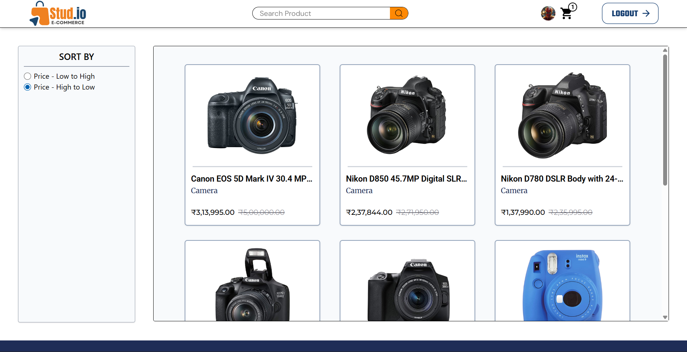
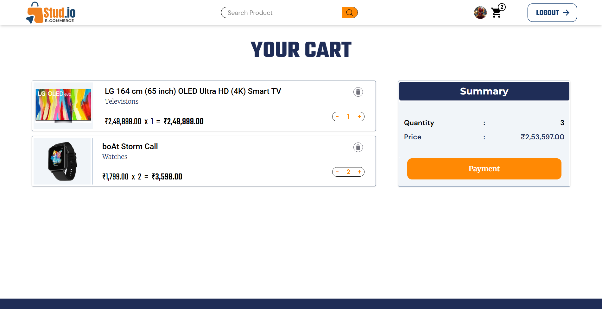
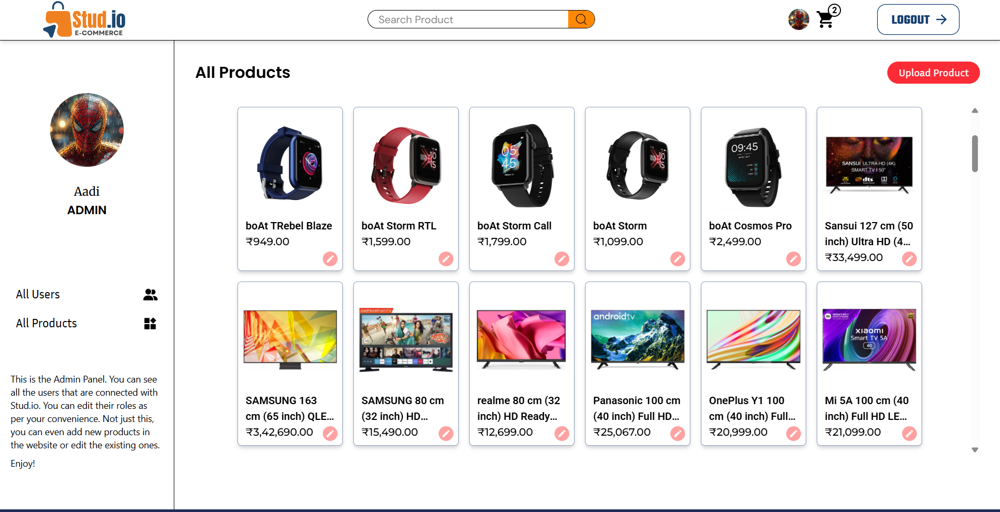

# Stud.io - E-Commerce Backend


Stud.io Backend is a robust REST API built with Node.js and Express.js that powers the Stud.io e-commerce platform. It provides comprehensive endpoints for user authentication, product management, shopping cart operations, and admin functionalities with JWT-based authentication and MongoDB database integration.

## Tech Stack

- **Runtime**: Node.js
- **Framework**: Express.js
- **Database**: MongoDB with Mongoose ODM
- **Authentication**: JWT (JSON Web Tokens)
- **Password Encryption**: bcryptjs
- **CORS**: Cross-Origin Resource Sharing support
- **Environment Management**: dotenv

## Features

- **User Authentication**: Secure user registration and login with JWT tokens
- **Password Security**: Bcrypt-hashed passwords for enhanced security
- **User Management**: View all users and update user roles (Customer, Admin)
- **Product Management**: Add, update, and retrieve products with categories
- **Product Search**: Full-text search functionality for products
- **Shopping Cart**: Add, view, update, and remove items from user carts
- **Cart Operations**: Real-time cart item count and cart management
- **Role-Based Access**: Differentiated permissions for customers and admins
- **Middleware Authentication**: Token validation for protected routes
- **CORS Support**: Configured for frontend integration

## Pre-requisites

Before you begin, ensure you have met the following requirements:

- Node.js (v14 or higher) and npm installed on your machine
- MongoDB installed locally or a MongoDB Atlas cloud connection string
- Postman or similar tool for API testing (optional)

## Project Structure

```
├── controller/
│   ├── product/              # Product management controllers
│   │   ├── uploadProduct.js
│   │   ├── getProducts.js
│   │   ├── updateProduct.js
│   │   ├── getCategoryProductOne.js
│   │   ├── getCategoryWiseProduct.js
│   │   ├── getProductDetails.js
│   │   └── searchProduct.js
│   └── user/                 # User management controllers
│       ├── userSignIn.js
│       ├── userLogin.js
│       ├── userLogout.js
│       ├── userDetails.js
│       ├── allUsers.js
│       ├── updateUserRole.js
│       ├── addToCartController.js
│       ├── viewCart.js
│       ├── updateCartController.js
│       ├── deleteCartProduct.js
│       └── countCartProducts.js
├── models/                   # Database schemas
│   ├── userModel.js
│   ├── productModel.js
│   └── addToCartModel.js
├── middleware/
│   └── authToken.js         # JWT authentication middleware
├── helpers/
│   └── permission.js        # Role-based permission checks
├── routes/
│   └── index.js             # API route definitions
├── index.js                 # Server entry point
└── package.json
```

## How to Run the Project Locally

1. **Clone the repository**:
   ```bash
   git clone https://github.com/yourusername/stud-io-backend.git
   cd stud-io-backend
   ```

2. **Install dependencies**:
   ```bash
   npm install
   ```

3. **Set up environment variables**:
   - Create a `.env` file in the root directory
   - Add the following variables:
     ```
     MONGODB_URI=mongodb://localhost:27017/studio
     PORT=8000
     FRONTEND_URL=http://localhost:5173
     JWT_SECRET=your_jwt_secret_key
     ```

4. **Start the development server**:
   ```bash
   npm start
   ```
   Or with nodemon for auto-reload:
   ```bash
   npx nodemon index.js
   ```

5. **Server will be running at**:
   - `http://localhost:8000`

## Available Scripts

- `npm start` - Start the server
- `npm test` - Run tests (to be configured)

## Deployed Link

Check out the live API at https://e-commerce-backend-t41z.onrender.com

## Database Models

### User Model
```
{
  username: String,
  email: String (unique),
  password: String (hashed with bcrypt),
  role: String (default: "GENERAL"),
  createdAt: Date,
  updatedAt: Date
}
```

### Product Model
```
{
  productName: String,
  brandName: String,
  category: String,
  productImage: Array,
  description: String,
  price: Number,
  selling: Number,
  createdAt: Date,
  updatedAt: Date
}
```

### Cart Model
```
{
  userId: ObjectId (ref: User),
  productId: ObjectId (ref: Product),
  quantity: Number (default: 1),
  createdAt: Date,
  updatedAt: Date
}
```

## API Endpoints

### Authentication
- `POST /api/signin` - User registration
- `POST /api/login` - User login
- `GET /api/logout` - User logout (requires auth)

### User Management (Admin)
- `GET /api/all-user` - Get all users (requires auth)
- `POST /api/update-user` - Update user role (requires auth)
- `GET /api/user-details` - Get current user details (requires auth)

### Products
- `POST /api/upload-product` - Upload a new product (admin only)
- `GET /api/get-products` - Get all products
- `POST /api/update-product` - Update product (admin only)
- `GET /api/get-categoryProduct` - Get first product of each category
- `POST /api/category-product` - Get products by specific category
- `POST /api/product-details` - Get detailed info for a product
- `GET /api/searchProduct` - Search products by query

### Shopping Cart
- `POST /api/addToCart` - Add item to cart (requires auth)
- `GET /api/countCart` - Get cart item count (requires auth)
- `GET /api/getCart` - View cart items (requires auth)
- `POST /api/updateCart` - Update cart item quantity (requires auth)
- `POST /api/deleteProduct` - Remove item from cart (requires auth)

## Authentication

The API uses JWT (JSON Web Tokens) for authentication. Protected routes require a valid token sent in the request headers:

```
Authorization: Bearer <token>
```

The token is generated during login and should be stored in the client-side cookies.

## Middleware

### authToken Middleware
- Validates JWT tokens from request cookies
- Protects routes that require authentication
- Used for user authentication verification

## Error Handling

The API implements comprehensive error handling for:
- Invalid credentials
- Missing required fields
- Unauthorized access attempts
- Database errors
- Invalid token/authentication failures

## CORS Configuration

CORS is configured to accept requests from the frontend URL specified in the `FRONTEND_URL` environment variable with credentials support.

## Security Features

- **Password Encryption**: Passwords are hashed using bcryptjs before storage
- **JWT Authentication**: Stateless authentication using JSON Web Tokens
- **Cookie-based Storage**: Secure token storage in HTTP-only cookies
- **Role-based Authorization**: Different access levels for admin and regular users

## Contributing

Contributions are welcome! Please feel free to submit a Pull Request.

## Project Wireframes

Below are the API architecture and workflow diagrams for the Stud.io backend:

| Home Page | Product Details |
|-----------|-----------------|  
|  |  |

| Product Listings | Shopping Cart |
|-----------|----------|  
|  |  |

| Admin Panel Products Database |
|----------|
|  |

## License

This project is licensed under the ISC License - see the LICENSE file for details.

---

**Built with ❤️ using Node.js, Express, and MongoDB**
